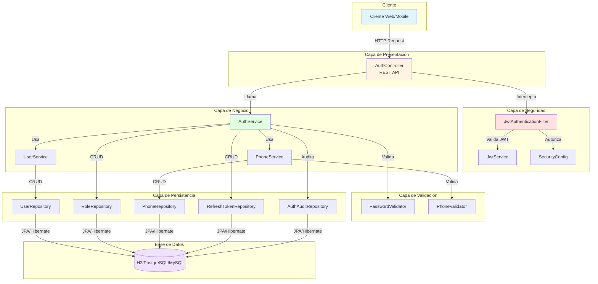
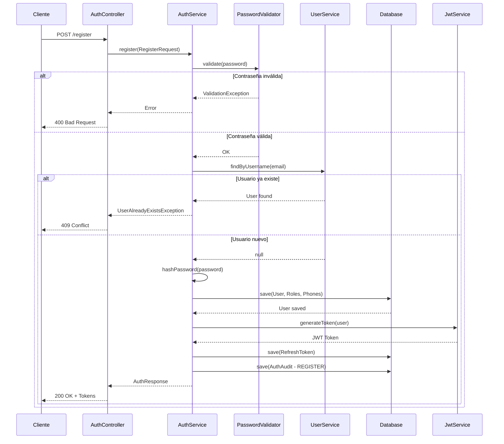
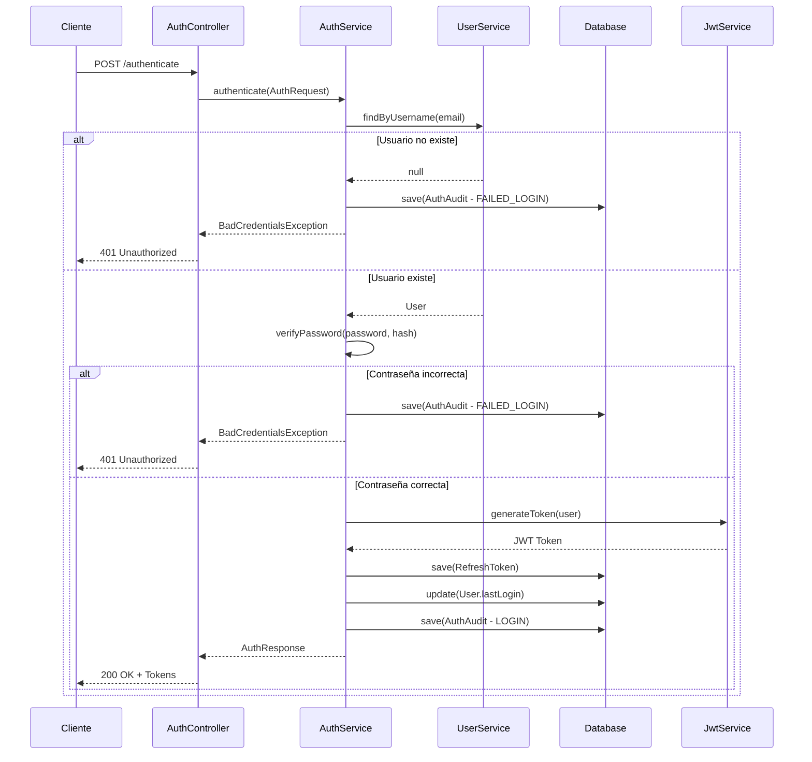
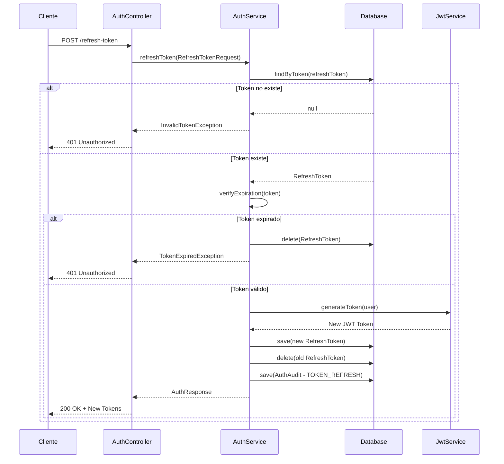
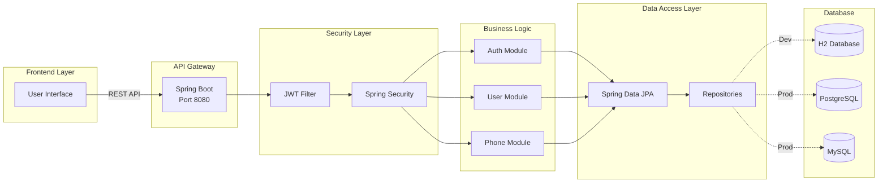
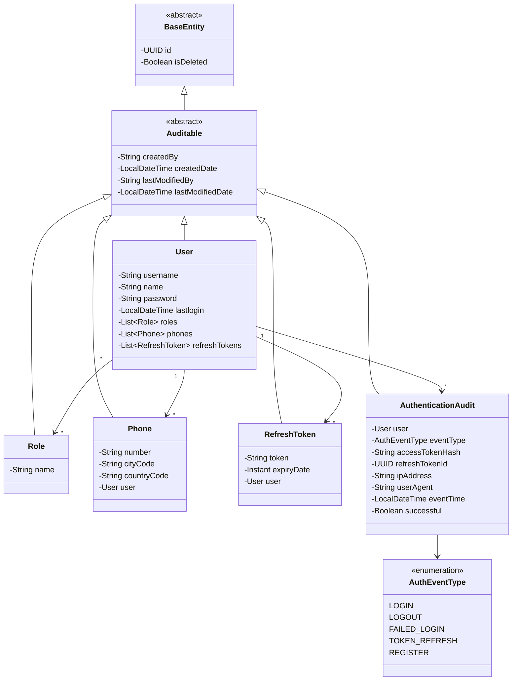
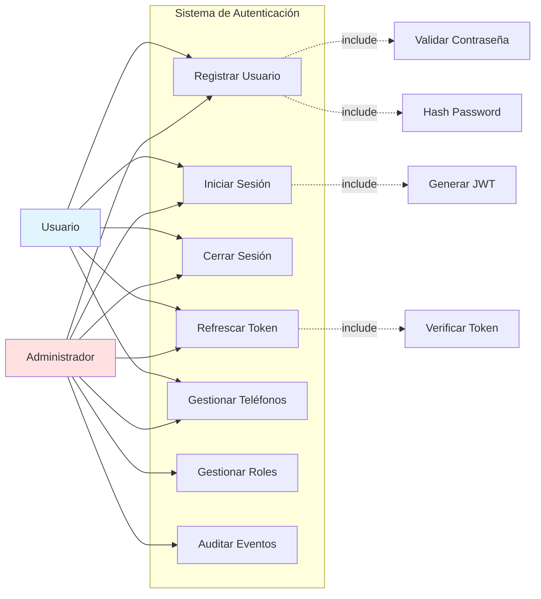
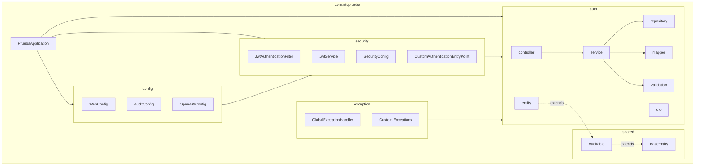

# Diagramas del Sistema - NTT-MVC Authentication System

Esta documentación contiene diferentes tipos de diagramas que puedes usar para presentar el sistema.

---

## 1. Diagrama de Arquitectura del Sistema



---

## 2. Diagrama de Flujo de Autenticación

### 2.1 Flujo de Registro



### 2.2 Flujo de Login



### 2.3 Flujo de Refresh Token



---

## 3. Diagrama de Componentes



---

## 4. Diagrama de Clases (Entidades)



---

## 5. Diagrama de Casos de Uso



---

## 6. Diagrama de Paquetes



---

## Cómo Usar Estos Diagramas

### Renderizar en Markdown
Estos diagramas usan **Mermaid**, que es compatible con:
- GitHub
- GitLab
- VS Code (con extensión)
- Notion
- Confluence
- Documentación web

### Exportar como Imagen
1. **Online**: Usa [Mermaid Live Editor](https://mermaid.live/)
   - Copia el código del diagrama
   - Exporta como PNG/SVG

2. **VS Code**: Instala la extensión "Markdown Preview Mermaid Support"
   - Abre este archivo
   - Click derecho → "Markdown: Export (pdf, html, png, jpeg)"

3. **CLI**: Usa `mermaid-cli`
   ```bash
   npm install -g @mermaid-js/mermaid-cli
   mmdc -i diagrama.md -o diagrama.png
   ```

### Personalizar
Puedes modificar los colores y estilos agregando al final de cada diagrama:
```
style NombreNodo fill:#color,stroke:#color,stroke-width:2px
```

---

## Recomendaciones por Contexto

| Contexto | Diagramas Recomendados |
|----------|------------------------|
| **Presentación Técnica** | Arquitectura + Componentes + Clases |
| **Documentación de Usuario** | Casos de Uso + Flujo de Autenticación |
| **Reunión con Stakeholders** | Arquitectura + Despliegue |
| **Onboarding de Desarrolladores** | Componentes + Paquetes + Clases |
| **Documentación de API** | Flujos de Autenticación (Secuencia) |
| **Revisión de Seguridad** | Flujo de Login + Estados + Arquitectura |
